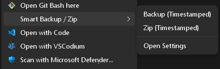

# Smart Backup & Zip [`bkdir` & `zpdir`] (Windows Edition)

A lightweight, frictionless, native Windows utility for creating timestamped folder backups and zip archives. Built entirely with native CMD commands (`robocopy` and Windows `tar.exe`)—strictly adhering to the **KISS** (Keep It Simple, Stupid) principle with zero external dependencies.

> 🍎 `Looking for the Mac Edition?`
> If you are on a Mac and need the native POSIX `tar` and Bash-based version of this tool with macOS Finder Quick Actions, check out the [Smart Backup & Zip (Mac Edition)](https://github.com/sucom/bak-zip-mac) repository.

## ✨ Features

* **100% Native Windows:** No third-party zipping utilities required. Built entirely on `robocopy` and Windows `tar.exe`.
* **Frictionless Context Menus:** Right-click any folder in Windows Explorer to access the "Smart Backup / Zip" cascading menu.
* **Global CLI Wrappers:** Use `bkdir` and `zpdir` commands globally from any standard Windows Command Prompt.
* **Git Bash Native Support:** Works seamlessly out-of-the-box inside Git Bash via auto-generated extensionless wrappers.
* **Smart Exclusions:** Pre-configured to ignore bulky directories (e.g., `node_modules`, `.git`, `dist`).
* **.gitignore Parsing:** Automatically reads and respects your project's `.gitignore` rules during backup/zip operations.
* **Intelligent Routing:** Configure relative backup targets (like `.\_backup`) or absolute dedicated backup drives.

## 🚀 Installation

1. Download or clone this repository to a temporary location.
2. Run `install.cmd` (double-click or execute via Command Prompt).
   * *This will deploy the tool to `%USERPROFILE%\bak-zip-cmd`, safely inject the directory into your User `%PATH%`, and install the registry keys for the Context Menu.*
3. **Restart your terminal** so the new `%PATH%` variables take effect.

## 🖱️ Explorer Context Menu Usage

Once installed, simply right-click any folder in Windows File Explorer. Look for the **Smart Backup / Zip** menu, which provides:



* **Backup (Timestamped):** Instantly creates a cloned folder with a timestamp (e.g., `my-project-20260531-082500`).
* **Zip (Timestamped):** Safely copies the folder, compresses it into a `.zip`, and cleans up the temporary files.
* **Open Settings:** Opens the configuration file in Notepad.

## 💻 CLI Usage

You can use the tool globally in your Command Prompt.

**Backup a folder:**
```cmd
bkdir .                 :: Backs up the current directory
bkdir C:\path\to\folder :: Backs up a specific directory
bkdir . -t D:\Backups   :: Backs up and overrides the destination target
```

**Zip a folder:**
```cmd
zpdir .                 :: Zips the current directory
zpdir C:\path\to\folder :: Zips a specific directory
```

**Other Commands:**
```cmd
bkdir -c                :: Open configuration file
bkdir -h                :: Show help menu
```

## ⚙️ Configuration (`bak-zip.cfg`)

The tool is driven by a simple configuration file located at `%USERPROFILE%\bak-zip-cmd\bak-zip.cfg`. You can open it anytime using `bkdir -c` or via the context menu.

**Default Configuration:**
```ini
# Opportunistic routing: If this folder exists relative to the source, use it.
SMART_TARGET=.\_backup

# Dedicated targets (absolute or relative paths). Leave blank to use target same as source.
BACKUP_TARGET=
ZIP_TARGET=

# Comma-separated list of exclusions (supports wildcards)
EXCLUDES=.git, node_modules, dist, build, .vscode*, *-lock.json, _backup*

# Automatically append exclusions found in the source directory's .gitignore file
EXCLUDE_FOLDERS_AND_FILES_IN_DOT_GITIGNORE=true

# Pause execution on completion/error (useful for Windows Context Menus)
PAUSE_ON_ERROR=true
```

## 🧹 Uninstallation

To completely remove the tool from your system, run:
```cmd
%USERPROFILE%\bak-zip-cmd\uninstall.cmd
```
*This will cleanly remove the Context Menus from the Windows Registry, scrub the tool from your `%PATH%`, and delete the installation folder. Your system is left completely clean.*

## License
MIT License.